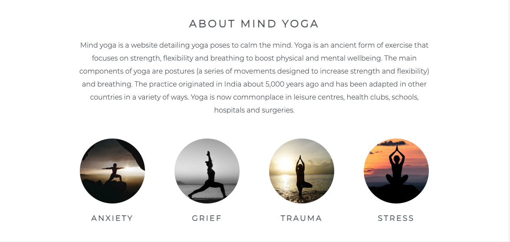
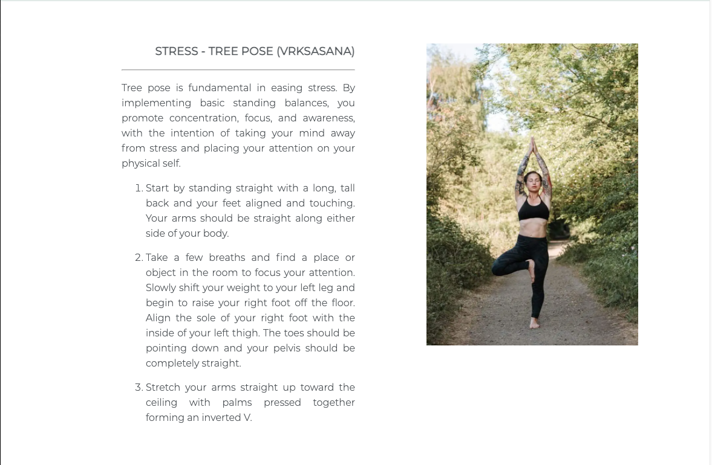
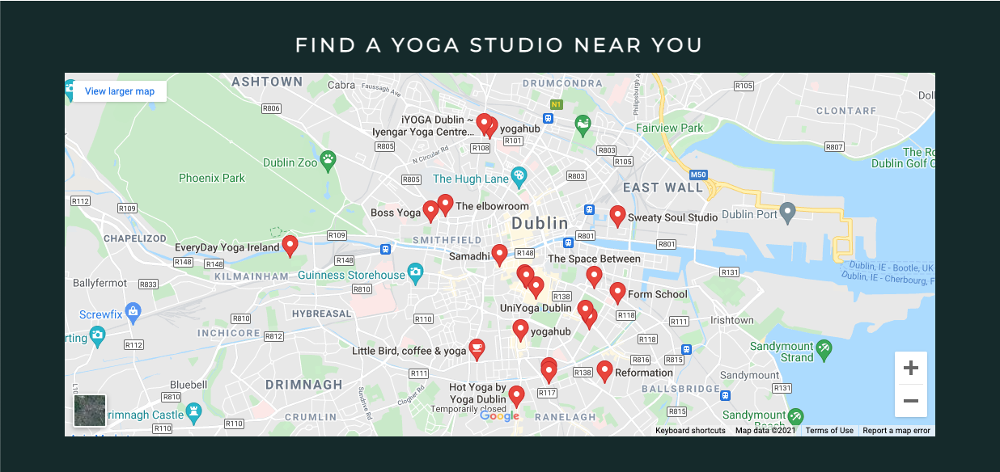
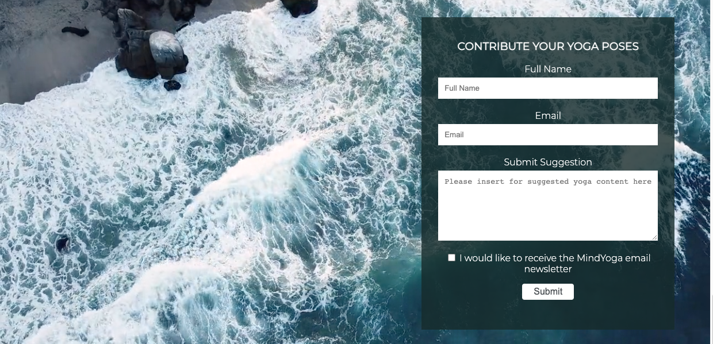

# Mind Yoga

Mind Yoga is a website that aims to teach users specific yoga poses to improve their mental wellbeing. The site is intended for users who wish to practice yoga in order to release difficult emotions such as stress, anxiety, trauma and grief. 

Mind Yoga includes step by step instructions for each specific pose along with images and a description of the benefits for each emotional state. Users who wish attend a yoga class can use the Google Maps section to find a class in their local area (DO I NEED TO SAY WHERE?). The site also includes a form section for users who wish to contribute their own suggested yoga poses.

The live link can be found here - [Mind Yoga](https://aliokeeffe.github.io/mindyoga/)

INSERT SCREENSHOT OF RESPONSINATOR 

## Site Owner Goals 
- To provide the user with information about the benefits of yoga with a particular focus on mental wellbeing. 
- To provide the user with clear and conscise instructions as to how to complete each pose along with a demonstrative image and a description of the emotional benefits
- To present the user with a website that is easy to navigate, fully responsive and invokes a sense of calm using colours and imagery. 
- To enable the user to locate yoga studios in their local area if they wish to continue their practice.
- To allow users to contribute their suggested yoga poses and sign up to the Mind Yoga Newsletter. 

## User Stories
- ## First time user
    - As a first time user I want learn about the benefits of yoga for my mental health.
    - As a first time user I want easily navigate to a yoga pose which matches my emotional state.  
    - As a first time user I want to find step by step instructions in order to complete the pose and to read about the emotional benefits.
    - As a first time user I want to be able to intuitively navigate the website and have a positive emotional experience. 
    

- ## Returning User
  - As a returning user I want to be able to contribute my suggested yoga poses to further benefit other users.
  - As a returning user I want to be able to find yoga studios in my locality to further my practice.

- ## Frequent User
  - As a frequent user I want to be able to sign-up to the Mind Yoga newsletter in order to get updates about new poses add to the website

## Design

### Colours
The two main colours used are green and white.

### Fonts
The Montserrat font is the main font used throughout the whole website with Sans Serif as the fallback font in case for any reason the font isn't being imported into the site correctly. Montserrat is a clean font used frequently in programming, so it is both attractive and appropriate.

### Imagery
The imagery used on the Mind Yoga site is very important to the overall experience of the user. A nature theme is consistantly used across all imagery with lots of green foliage forest scenes.  grounding in nature and invoke a sense of calm in the user. The colour green is also imporant as this ties into the overall colour scheme of the site. 

## Colours, Fonts and Imagery
## Wireframes

## Features
- ### Navigation

    - The fully responsive navigation bar includes links to the Logo, Home, About, Poses, Practice and Contribute sections of the same page.
    - The Poses navigation link includes a drop down menu which includes further links to each emotional state within the Poses section.
    - The navigation bar has a fixed position so that is remains visible at the top of the page as the user navigates through the individual sections. 
    - This section allows the user to easliy navigative through the site to find content without have to scroll back up to top of the page or use the browser back button.

- ### The Landing Page Image
    - The landing page includes an eye catching image with text overlay describing the site's goal.
    - This section provides the user with a clear visual representation of the purpose of the site.

 

- ### About Section
    - The About Section gives a brief description of the benefits of yoga for mental wellbeing and also gives further details about what the site offers to users.
    - Below the about text there are four small images with navigation links to each emotional state within the Poses Section.
    - This section will show users the value of practicing yoga for their mental wellbeing and the image links invite the user to further explore the site as an alternative to the navigation bar. 

 

- ### Poses Section
    - This section contains four yoga poses with each pose linked to a different difficult emotion. 
    - This section is valuable as the user is provided with step by step instructions as to how to complete each pose along with a demonstrative image and a description of the emotional benefits. 

 
  

- ### Practice Section
    - The Practice Section includes an iframe with an embedded Google Map showing the locations of yoga studios around Dublin.
    - This section will enable the user find a yoga studio within their locality should they wish to attend a class.

 

- ### Contribute Section
    - The contribute section includes a background video of ocean waves with a form overlay.
    - The user is invited to sign up to Mind Yoga to contribute their suggested Yoga pose and they can also opt in to receive the Mind Yoga Newsletter.
    - The user can input their full name, email address and yoga pose suggestion. They can select the checkbox if they wish to receive the newsletter.

 

- ### Footer
    - The footer section includes links to Mind Yoga's Facebook, Instagram, Twitter and Youtube pages.
    - The links will open to a new tab to allow easy navigation for the user. 
    - The footer is valuable to the user as it allows them to find and follow Mind Yoga on social media

 

### Features Left to Implement
- Burger button for the mobile nav bar.
- The ability to search by emotion as the bank of poses grows

## Testing

Testing was done on a continuous basis using the live preview on Gitpod in addition to developer tools on the Chrome browser.

Additional testing was done by submitting code for peer-to-peer review on The Code Institute Slack channel

## Validator Testing
- ### HTML
    - No errors were returned when passing through the official W3C Validator (INSERT LINK)
- ### CSS
    - No errors were found when passing through the official Jigsaw Validator (INSERT LINK)
- ### Accessibility 
    - The site acheived a Lighthouse accessibility score of XX which confirms that the colours and fonts chosen are easy to read and accessible (INCLUDE SCREENSHOT)

## Form Testing
- The form has been tested to ensure it would not submit without the required input fields being filled in (full name and email address).

## Links Testing
- All navigation links were tested manually to ensure the user is directed to the correct section of the website.
- Social Media links in the footer of each page were tested manually to ensure they direct the user to the correct page and open in a new tab. 

## Browser Testing
- The Website was tested on Google Chrome, Internet Explorer, Firefox, Microsoft Edge, Safari browsers.
    
## Device Testing
- The website was viewed on a variety of devices such as Desktop, Laptop, iPhone7, iPhone 8 & iPhoneX. (ADD IN THE REST)

## Friends and Family User Testing
Friends and family members were asked to review the site and documentation to point out any bugs and/or user experience issues.

## Fixed Bugs
### Anchor link scroll with a fixed position header
The header element contains anchor links to allow the user to navigate to different sections within the website. By default, these will scroll so that the target element is flush with the top of the browser window.

When I then updated the header to use a fixed top position, the beginning of each section ended up being covered by the header, which wasn’t ideal.

To resolve this I created span elements at the top of each section and applied a negative top margin that matched the height of the header. This way, when the user clicks on a nav link, the browser window scrolls to the top of the corresponding session. 

### Using padding on elements with 100% width / CSS Box Model
When I first implemented my section elements I set them to use a width of 100%. When I later added content to some of these, I applied padding to create more space for the text and images. 

I did not expect the padding to be added to the width of the content box of the Section and didn’t understand why the Sections with added padding rendered at a different size to those that did not. 

I read up a bit more about the CSS Box Model and then implemented a new Div element with no defined width inside of the relevant Section elements, on which I was able to apply the required padding, while ensuring that the width of 100% was applied to all Section elements consistently.

### Centering the cover text when it’s positioning is absolute

### Unfixed Bugs
There are no unfixed bugs

## Technologies Used
## Deployment

## Credits
### Content
### Media
google maps
### Code

## Wireframes
Home Page Wireframe - View

intuitive, simple, enjoyable to use
positive user experience
does it fit my needs
positive emotional response
product must be valuable
user must want to return
can a user understand and comfortably navigative through the site upon seeing it for the first time.