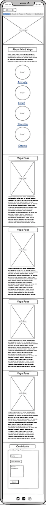

# Mind Yoga

Mind Yoga is a website that aims to teach users specific yoga poses to improve their mental wellbeing. The site is intended for users who wish to practice yoga in order to release difficult emotions such as stress, anxiety, trauma and grief. 

Mind Yoga includes step by step instructions for each specific pose along with images and a description of the benefits for each emotional state. Users who wish to attend a yoga class can use the Google Maps section to find a class in their local area. The site also includes a form section for users who wish to contribute their own suggested yoga poses.

The live link can be found here - [Mind Yoga](https://aliokeeffe.github.io/mindyoga/)

## Site Owner Goals 
- To provide the user with information about the benefits of yoga, with a particular focus on mental wellbeing. 
- To provide the user with clear and concise instructions as to how to complete each pose along with a demonstrative image and a description of the emotional benefits.
- To present the user with a website that is easy to navigate, fully responsive and invokes a sense of calm through the use of appropriate colours and imagery. 
- To enable the user to locate yoga studios in their local area if they wish to continue their practice.
- To allow users to contribute their suggested yoga poses and sign up to the Mind Yoga Newsletter. 

## User Stories
- ### First time user
  - As a first time user I want to understand the main purpose of the site and learn about the benefits of yoga for my mental health.
  - As a first time user I want to be able to intuitively navigate the website and have a positive emotional experience. 
  - As a first time user I want to be able to browse yoga content without having to sign-up / register.

- ### Returning User
  - As a returning user I want to easily navigate to a yoga pose which matches my emotional state.  
  - As a returning user I want to find step by step instructions in order to complete the pose and to read about the emotional benefits.
  - As a returning user I want to be able to find yoga studios in my locality to further my practice.

- ### Frequent User
  - As a frequent user I want to be able to sign-up to the Mind Yoga newsletter in order to get updates about new poses added to the website.
  - As a frequent user I want to be able to contribute my suggested yoga poses to further benefit other users.

## Design

### Imagery
The imagery used on the Mind Yoga site is very important to the overall experience of the user. A nature theme is consistently used across all imagery with lots of green foliage and forest scenes. This gives the sense of grounding in nature which has great benefits for mental health and is intended to invoke a sense of calm in the user. The colour green is also important as this ties into the main colour scheme of the site. 

### Colours
The colour scheme of the website is white and green with varying shades of green used to tie in with the nature imagery. A dark grey font is used which has a good contrast with the light green and white backgrounds making it easy to read. 

### Fonts
The Montserrat font is the main font used throughout the whole website. This font was imported via [Google Fonts](https://fonts.google.com/). I'm using Sans Serif as a backup font, in case for any reason the main font isn't being imported into the site correctly.

## Wireframes
Wireframes were produced using Balsamiq. 

 

 
Desktop Wireframe

 

 

    
Mobile Wireframe

 

## Features
- ### Navigation

    - The fully responsive navigation bar includes links to the Logo, Home, About, Poses, Practice and Contribute sections of the same page.
    - The Poses navigation link includes a drop down menu which includes further links to each emotional state within the Poses section.
    - The navigation bar has a fixed position so that it remains visible at the top of the page as the user navigates through the individual sections. 
    - A drop shadow was applied to the navigation bar to make sure that it doesn't blend into the other sections of the page upon scrolling.
    - This section allows the user to easily navigate through the site to find content without having to scroll back up to the top of the page or use the browser back button.

- ### The Landing Page Image
    - The landing page includes an eye-catching image with a text overlay describing the site's goal.
    - This section provides the user with a clear visual representation of the purpose of the site.

 

- ### About Section
    - The About Section gives a brief description of the benefits of yoga for mental wellbeing and also gives further details about what the site offers to users.
    - Below the About text there are four small images with navigation links to each emotional state within the Poses Section.
    - This section will show users the value of practicing yoga for their mental wellbeing and the image links invite the user to further explore the site as an alternative to the navigation bar. 

- ### Poses Section
    - This section contains four yoga poses with each pose linked to a different difficult emotion. 
    - This section is valuable as the user is provided with step by step instructions as to how to complete each pose along with a demonstrative image and a description of the emotional benefits. 

  

- ### Practice Section
    - The Practice Section includes an iframe with an embedded Google Map showing the locations of yoga studios around Dublin.
    - This section will enable the user to find a yoga studio within their locality should they wish to attend a class.

- ### Contribute Section
    - The contribute section includes a background video of ocean waves with a form overlay.
    - The user is invited to sign up to Mind Yoga and contribute their suggested Yoga pose. They can also opt in to receive the Mind Yoga Newsletter by selecting the checkbox provided.

 

- ### Footer
    - The footer section includes links to Mind Yoga's Facebook, Instagram, Twitter and Youtube pages.
    - The links will open to a new tab to allow easy navigation for the user. 
    - The footer is valuable to the user as it allows them to find and follow Mind Yoga on social media

### Features Left to Implement
- Burger button for the mobile nav bar.
- The ability to search by emotion as the bank of poses grows.

## Testing

### Validator Testing
- #### HTML
    - No errors were returned when passing through the official W3C Markup Validator
        - [W3C Validator Results](https://validator.w3.org/nu/?doc=https%3A%2F%2Faliokeeffe.github.io%2Fmindyoga%2Findex.html)
- #### CSS
    - No errors were found when passing through the official W3C CSS Validator 
        - [W3C CSS Validator Results](https://jigsaw.w3.org/css-validator/validator?uri=https%3A%2F%2Fvalidator.w3.org%2Fnu%2F%3Fdoc%3Dhttps%253A%252F%252Faliokeeffe.github.io%252Fmindyoga%252Findex.html&profile=css3svg&usermedium=all&warning=1&vextwarning=&lang=en)
- #### Accessibility 
    - The site achieved a Lighthouse accessibility score of 100% which confirms that the colours and fonts chosen are easy to read and accessible

### Form Testing
- The form has been tested to ensure it would not submit without the required input fields being filled in (full name and email address).

### Links Testing
- All navigation links were tested manually to ensure the user is directed to the correct section of the website.
- Social Media links in the footer of each page were tested manually to ensure they direct the user to the correct page and open in a new tab. 

### Browser Testing
- The Website was tested on Google Chrome, Firefox, Microsoft Edge, Safari browsers with no issues noted.
    
### Device Testing
- The website was viewed on a variety of devices such as Desktop, Laptop, iPhone 8, iPhoneX and iPad to ensure responsiveness on various screen sizes. The website performed as intended. The responsive design was also checked using Chrome developer tools across multiple devices with structural integrity holding for the various sizes.
- I also used the following websites to test responsiveness:
    - [Am I Responsive](http://ami.responsivedesign.is/)
    - [Responsinator](http://www.responsinator.com/)

### Friends and Family User Testing
Friends and family members were asked to review the site and documentation to point out any bugs and/or user experience issues.

### Fixed Bugs
#### Anchor link scroll with a fixed position header
- The header element contains anchor links to allow the user to navigate to different sections within the website. By default, these will scroll so that the target element is flush with the top of the browser window.
- When I updated the header to use a fixed top position, the beginning of each section ended up being covered by the header, which wasn’t ideal.
- To resolve this I created div elements at the top of each section and applied a relative position with a -75px top position (the same height as the header). This way, when the user clicks on a nav link, the browser window scrolls to the top of the corresponding section. 

#### Using padding on elements with 100% width / CSS Box Model
- When I first implemented my section elements I set them to use a width of 100%. When I later added content to some of these, I applied padding to create more space for the text and images. 
- I did not expect the padding to be added to the width of the content box of the Section and didn’t understand why the Sections with added padding rendered at a different size to those that did not. 
- I read up a bit more about the CSS Box Model and then implemented a new Div element with no defined width inside of the relevant Section elements, on which I was able to apply the required padding, while ensuring that the width of 100% was applied to all Section elements consistently.

### Known Bugs
HTML Smooth Scroll does not work on Safari browser.

## Technologies Used

### Languages
- HTML5
- CSS

### Frameworks - Libraries - Programs Used
- [Am I Responsive](http://ami.responsivedesign.is/) - Used to verify responsiveness of website on different devices.
- [Responsinator](http://www.responsinator.com/) - Used to verify responsiveness of website on different devices.
- [Balsamiq](https://balsamiq.com/) - Used to generate Wireframe images.
- [Chrome Dev Tools](https://developer.chrome.com/docs/devtools/) - Used for overall development and tweaking, including testing responsiveness and performance.
- [Font Awesome](https://fontawesome.com/) - Used for Social Media icons in footer.
- [GitHub](https://github.com/) - Used for version control and hosting.
- [Google Fonts](https://fonts.google.com/) - Used to import and alter fonts on the page.
- [TinyPNG](https://tinypng.com/) - Used to compress images to reduce file size without a reduction in quality.
- [W3C](https://www.w3.org/) - Used for HTML & CSS Validation.

## Deployment

The project was deployed using GitHub pages. The steps to deploy using GitHub pages are:

1. Go to the repository on GitHub.com
2. Select 'Settings' near the top of the page.
3. Select 'Pages' from the menu bar on the left of the page.
4. Under 'Source' select the 'Branch' dropdown menu and select the main branch.
5. Once selected, click the 'Save'.
6. Deployment should be confirmed by a message on a green background saying "Your site is published at" followed by the web address.

The live link can be found here - [Mind Yoga](https://aliokeeffe.github.io/mindyoga/)

## Credits

### Content
All educational yoga content was sourced from the below websites:
- [Yoga Journal](https://www.yogajournal.com)
- [Amayaan](https://www.amayaan.com/)
- [Ekhart Yoga](https://www.ekhartyoga.com)
- [Mind Body Green](https://www.mindbodygreen.com)
- [Class Pass](https://classpass.com)
- [Art of Living](https://www.artofliving.org)

### Media
All images and videos were sourced from the below websites with thanks to the below amazing photographers/videographers
- [Pexels](https://www.pexels.com/)
    - Enrrique Hoyos - Waves Video
    - Anete Lusina - Tree Pose Image
    - Daria Klimova - Standing Forward Fold Pose Image
- [Unsplash](https://unsplash.com)
    - Mikita Karasiou - Hero Image
    - Tabitha Turner - Upward Facing Dog Pose Image
    - Balu Gáspár - Childs Pose Image
    - Tima Miroshnichenko - Yoga Silhouette
- [PXhere](https://pxhere.com/)
    - Mohamad Hassan - Yoga Silhouette
    - Dave Contreras - Yoga Silhouette

### Resources Used

- [W3Schools](https://www.w3schools.com/)
- [Stack Overflow](https://stackoverflow.com/)

## Acknowledgments
My mentor Antonio for his support and advice.

The Code Institute slack community for their quick responses and very helpful feedback!